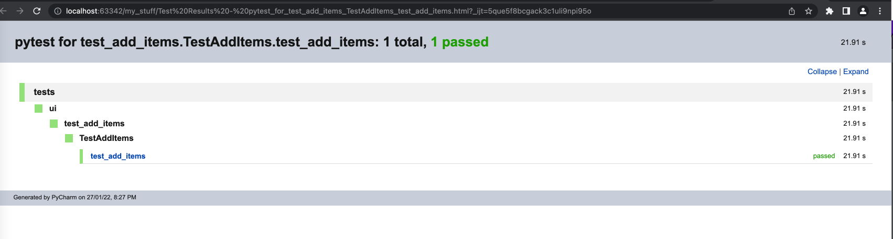

# Assignment 

For this assignment i have used python as a primary language and pytest as autoamtion framework. 

Steps to execute. 

```
pip install -r requirements.txt
pytest -k test_add_items 
```




Testcases can be executed in docker image also. 

TODO 
- Add logger support to show debug logs. 
- Add more helper methods.

    
